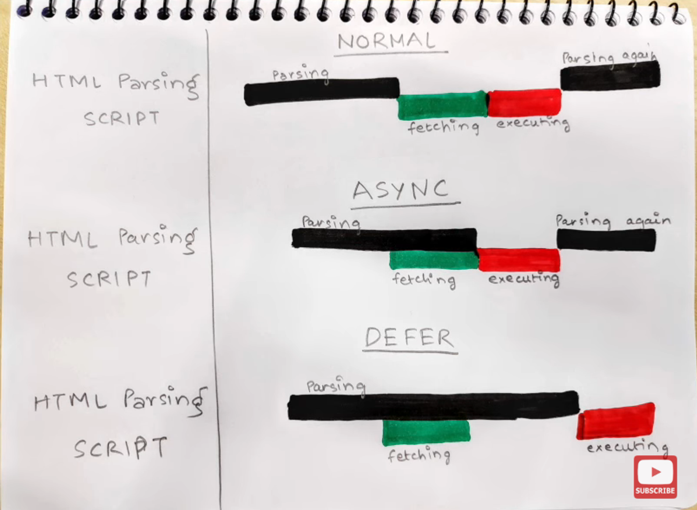

# Types of Scripting:

# Inline Scripting: 
JS functions are defined in HTML elements so that they are individual and accessible only to those specified elements.

# Embed Scripting: 
JS functions are defined within the page by `` , you can place it in `<head>` tag or `<body>` tag.

#### 💡 defer vs. async vs. normal parsing script
- defer in `<script>` tag: it is useful if your scripts depend on the DOM being in place
-  async in `<script>` tag: it is useful when the scripts in the page run independently from each other and depend on no other script on the page.

---
# Js Comment
    Code after double slashes // (single line comment) or between /* and */ (multi line comment) is treated as a comment.
    can’t nest the block comments.